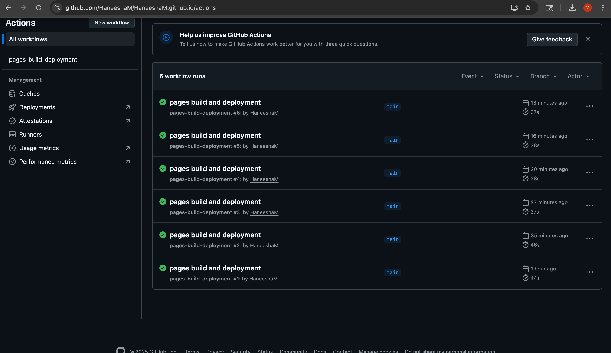

# CI/CD Pipeline Report

## Student Information
- Name: Haneesha Mallipeddi
- Date: 11/09/2025
- Repository: https://github.com/HaneeshaM/HaneeshaM.github.io
- Live URL: https://HaneeshaM.github.io

## Deployment History
Check the Actions tab for complete deployment history.

### Iteration Summary
1. **Initial Deployment**
    - Commit: a38ef8b
    - Time to Deploy: 44 seconds
    - Status: Success

2. **Iteration 1: Personalization**
    - Commit: [COMMIT HASH FOR PERSONALIZATION]
    - Changes Made: Replaced all instances of "Your Name" with my actual name; updated university name and graduation year in `about.html`.
    - Deployment Time: [X seconds]
    - Status: Success

3. **Iteration 2: Deploy Info**
    - Commit: [COMMIT HASH FOR DEPLOY INFO]
    - Changes Made: Created `deploy-info.json` and updated `projects.html` to include the CI/CD Pipeline Status card and link.
    - Deployment Time: [X seconds]
    - Status: Success

4. **Iteration 3: Feature Branch**
    - PR Number: #1
    - Branch: feature/add-contact
    - Deployment triggered by: Pull Request merge
    - Changes Made: Created `contact.html` and updated the navigation links across all HTML pages.
    - Status: Success

## CI/CD Understanding

### What is CI/CD?
CI/CD is a set of practices that enable rapid, reliable, and continuous delivery of software. **Continuous Integration (CI)** involves developers frequently merging code changes into a central repository, where automated builds and tests are run. **Continuous Deployment (CD)** automates the release of that validated code to production environments, ensuring that every successful code change goes live quickly and reliably.

### Benefits Observed
1. **Increased Development Speed and Automation ⚡:** The process automates the manual steps of deployment. Once code is pushed to the `main` branch, the site is **automatically built and deployed** without requiring any manual server uploads or configuration changes. This significantly speeds up the delivery cycle.
2. **Consistency and Reliability ✅:** The deployment process is executed using a predefined script (the GitHub Action). This ensures that every deployment follows the **exact same steps**, eliminating human error that can occur in manual deployment (like forgetting to upload a file or running a build command incorrectly).
3. **Visibility and Traceability 👁️:** The **GitHub Actions** tab provides a single, centralized place to view the status, logs, and history of every single deployment. I can easily see when a change was deployed, what commit triggered it, and how long the process took, improving project transparency.

### Challenges Faced
No significant challenges encountered. The process was straightforward after resolving an initial Git pull conflict.

### Real-World Application
In larger software projects, CI/CD is **fundamental** for managing complexity and team collaboration. It ensures that code from dozens of developers is continuously integrated and tested automatically, catching bugs early before they reach production. The CD (Continuous Deployment) portion allows companies to release small, frequent updates (like feature flags or security patches) instantly to users with high confidence, enabling a faster response to market needs and critical vulnerabilities.

## Screenshots

- [x] Initial deployment
      

- [x] GitHub Actions tab showing successful builds
      ****
      
- [x] Live website after final iteration
      ****